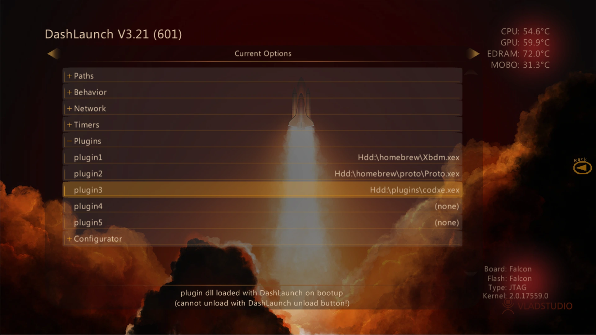

import { LinkButton, FileTree, Aside } from "@astrojs/starlight/components";

CoD Xe is the plugin that loads CoD Xenon mods on Xbox 360 and Xenia.

Follow this page once, then return to the game-specific guide for the title
update and mod files.

## What You Need

- An Xbox 360 that can run unsigned code: **XDK**, **RGH**, **JTAG**, or
  **BadUpdate**
- Or **Xenia Canary Netplay** on Windows
- A supported game extracted to a normal folder

<Aside type="caution" title="Use game-specific title updates">
  CoD Xe requires the correct title update for each game. Install the title
  update listed in the guide you are following.
</Aside>

## Xbox 360

Download the standalone plugin:

<LinkButton
  href="https://github.com/michaeloliverx/codxe/releases/latest/download/codxe.xex"
  download
  icon="download"
>
  Download **CoD Xe**
</LinkButton>

Set `codxe.xex` as a [DashLaunch](https://consolemods.org/wiki/Xbox_360:DashLaunch) plugin.

Your plugin setup should look similar to this:



After saving your DashLaunch settings, reboot the console.

## Xenia

Use this path when running CoD Xe through Xenia instead of Xbox 360 hardware.

<Aside type="caution" title="Use the latest Xenia Canary Netplay">
  CoD Xe requires the latest version of Xenia Canary Netplay. Older builds may
  fail to load plugins or crash in ways that are already fixed upstream.
</Aside>

Download Xenia Canary Netplay:

<LinkButton
  href="https://github.com/AdrianCassar/xenia-canary/releases/latest"
  icon="download"
>
  Download **Xenia Canary Netplay**
</LinkButton>

### Enable Plugins

Open Xenia once so it creates the config file beside the executable:

<FileTree>

- `Xenia Canary Netplay`
  - xenia_canary_netplay.exe
  - **xenia-canary-netplay.config.toml**

</FileTree>

Close Xenia, open the config file, and change these values:

```diff lang="toml"
- allow_plugins = false
+ allow_plugins = true

- allow_game_relative_writes = false
+ allow_game_relative_writes = true
```

<Aside type="caution" title="Close Xenia before editing">
  Close Xenia before changing the config file. If you edit the config while
  Xenia is open, the change will **not save**.
</Aside>

### Copy Files

Download the latest CoD Xe release `.zip`. Do not use the standalone
`codxe.xex` download for Xenia. The `.zip` contains additional Xenia files that
Xbox 360 hardware users do not need.

<LinkButton
  href="https://github.com/michaeloliverx/codxe/releases/latest"
  icon="download"
>
  Download **CoD Xe release zip**
</LinkButton>

After extracting the CoD Xe `.zip`, the folder should look similar to this:

<FileTree>

- codxe
  - iw3/
  - t4/
  - xenia
    - patches/
    - plugins/
  - ...

</FileTree>

Copy the contents of the extracted `codxe` folder's `xenia` folder into the
same folder as `xenia_canary_netplay.exe`.

When copied correctly, your Xenia folder should look similar to this:

<FileTree>

- `Xenia Canary Netplay`
  - patches/
  - plugins/
  - xenia_canary_netplay.exe
  - xenia-canary-netplay.config.toml

</FileTree>

### Next Step

Install the title update required by the game guide you are following, then boot
the game's multiplayer `.xex`.
