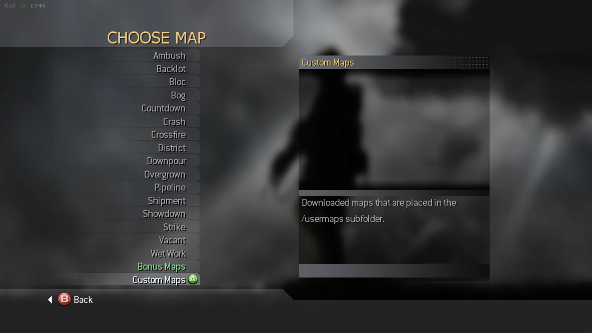
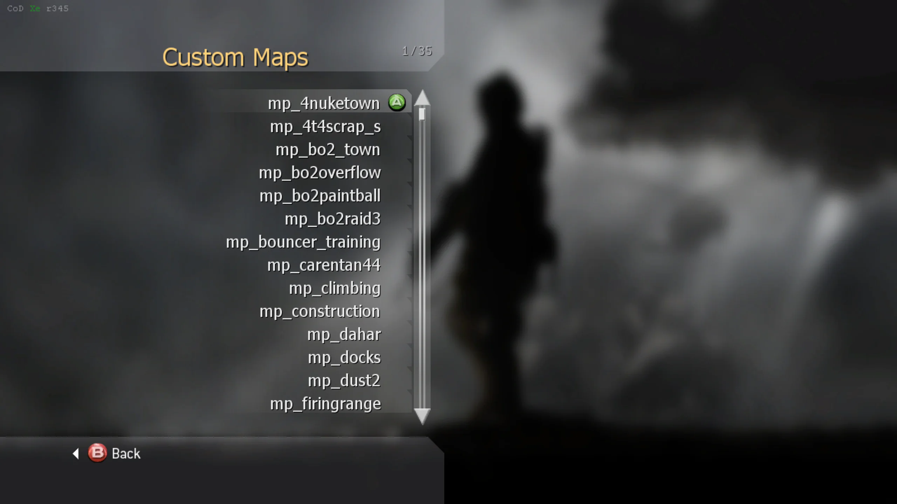

import {
  Aside,
  CardGrid,
  FileTree,
  LinkButton,
  LinkCard,
} from "@astrojs/starlight/components";

This package contains the CoD Xe fastfiles needed for Call of Duty 4, together
with a collection of custom maps. Keeping them in one download makes
sure the fastfiles and maps stay compatible.

:::note[Map credits]
All credit and respect goes to the original creators of the included custom maps.
:::

## What You Need

- A **genuine USA / Europe copy** of Call of Duty 4: Modern Warfare
- Call of Duty 4 **TU4**
- The latest **CoD Xe** plugin

Install CoD Xe before continuing:

<CardGrid>
  <LinkCard
    title="Xbox 360"
    href="/guides/codxe/xbox-360/"
    description="Install CoD Xe on an Xbox 360."
  />
  <LinkCard
    title="Xenia"
    href="/guides/codxe/xenia/"
    description="Install CoD Xe on Xenia Canary."
  />
</CardGrid>

## Download and Install

<LinkButton
  href="https://downloads.codxenon.dev/codxe-iw3-fastfiles-v0.1.0.zip"
  download
  icon="download"
>
  Download **CoD Xe IW3 Fastfiles v0.1.0**
</LinkButton>

1. Extract the `.zip`.
2. Open the extracted `codxe-iw3-fastfiles-v0.1.0` folder.
3. Copy its `_codxe` folder into your Call of Duty 4 game folder and allow it
   to merge with your existing `_codxe` folder.

Do **not** delete or replace your existing `_codxe` folder.

When installed correctly, the relevant files should look like this:

<FileTree>

- `Call of Duty 4 - Modern Warfare`
  - \_codxe
    - zone
      - **codxe_common_mp.ff**
      - **codxe_ui_mp.ff**
    - usermaps
      - mp_4nuketown
        - mp_4nuketown.ff
        - mp_4nuketown_load.ff
      - mp_mw2_rust
        - mp_mw2_rust.ff
        - mp_mw2_rust_load.ff
      - ...
  - default_mp.xex
  - ...

</FileTree>

## Required Fastfiles and Optional Maps

The fastfiles in `_codxe/zone` are required for CoD Xe on Call of Duty 4. Keep
`codxe_common_mp.ff` and `codxe_ui_mp.ff` installed, even if you do not want to
play custom maps.

The maps in `_codxe/usermaps` are optional. You can leave them installed to
play them, or remove individual map folders later if you need the storage.

## Use Custom Maps

CoD Xe automatically adds maps in `_codxe/usermaps` to the map picker. The
**Custom Maps** list updates when map folders are added or removed.

1. When choosing a map for a System Link or private match, select
   **Custom Maps**.

2. Select a map from the scrollable list.

## Next Step

Install [IW3 Bot Warfare](/guides/iw3/bot-warfare/) to add bots to Call of Duty
4 multiplayer.
