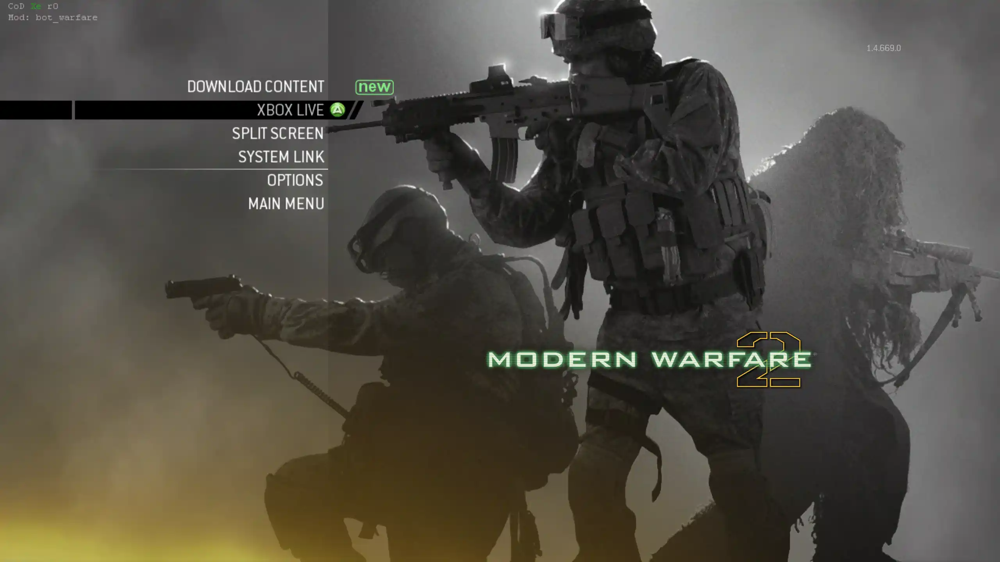
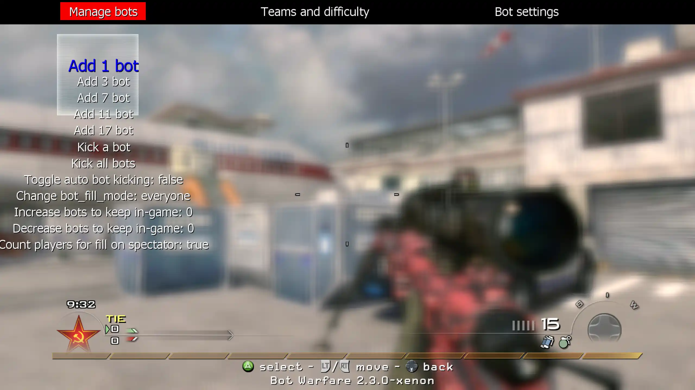
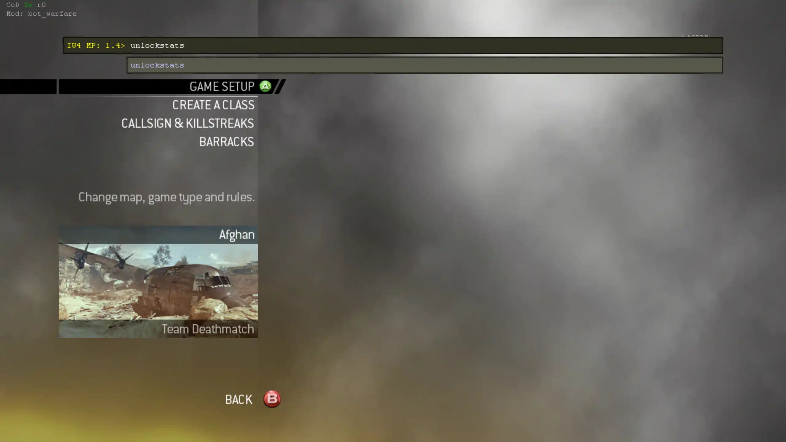
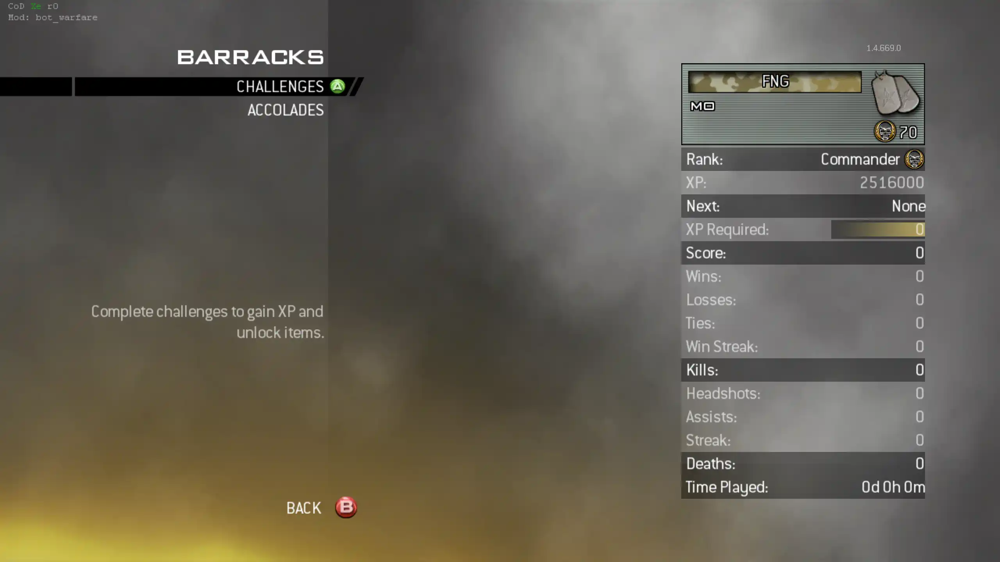

import { LinkButton, FileTree, Aside } from "@astrojs/starlight/components";

Bot Warfare adds playable AI bots to Call of Duty: Modern Warfare 2 multiplayer.

The original mod was created by [INeedGames](https://ineedbots.github.io). This port runs through the CoD Xe plugin.

<LinkButton
  href="https://github.com/codxenon/iw4-bot-warfare-xenon"
  icon="github"
>
  View **IW4 Bot Warfare Xenon port** on GitHub
</LinkButton>

## What You Need

- A **genuine** copy of Call of Duty: Modern Warfare 2
- The game extracted to a normal folder
- The Call of Duty: Modern Warfare 2 title update used by this guide: **TU6**
- One of these setups:
  - An Xbox 360 that can run unsigned code: **XDK**, **RGH**, **JTAG**, or **BadUpdate**
  - **Xenia Canary Netplay** on Windows

<Aside type="caution" title="Supported region">
  Use the **USA / Europe** region of Call of Duty: Modern Warfare 2. Other
  regions are not supported.
</Aside>

<Aside type="caution" title="Supported title update">
  IW4 Bot Warfare currently requires **TU6**. Other title updates are not
  supported by this guide.
</Aside>

## Prepare The Game

Extract Call of Duty: Modern Warfare 2 to a normal folder.

Do not use:

- GOD / Games on Demand format
- ISO format

Your game folder should contain the normal game files, such as `default_mp.xex`.

## Install CoD Xe

CoD Xe is required. Bot Warfare will not load without it.

Install CoD Xe first, then return to this guide:

<LinkButton href="/guides/codxe/" icon="right-arrow">
  Install **CoD Xe**
</LinkButton>

## Install TU6

Call of Duty: Modern Warfare 2 must be running **TU6**.

<Aside type="caution" title="Remove TU9 first">
  If the **TU9** file, the latest Modern Warfare 2 update, is still installed,
  Xbox 360 or Xenia will prefer TU9 over TU6. Delete TU9 before installing TU6.

On Xbox 360, the TU9 file is stored at
`Hdd1/Cache/TU_10LC20N_0000018000000.000000000028A`.

</Aside>

Download the TU6 file:

<LinkButton
  href="https://github.com/codxenon/xbox360-title-updates/raw/refs/heads/main/games/Call%20of%20Duty%20-%20Modern%20Warfare%202%20%28USA%2C%20Europe%29/TU6/TU_10LC20N_0000018000000.00000000001GA"
  download
  icon="download"
>
  Download **Modern Warfare 2 TU6**
</LinkButton>

### Xbox 360

Copy the downloaded TU6 file to `Hdd1/Cache/`:

```text
Hdd1/Cache/TU_10LC20N_0000018000000.00000000001GA
```

### Xenia

Press `File` > `Install Content...`, then select the downloaded TU6 file:

```text
TU_10LC20N_0000018000000.00000000001GA
```

After TU6 is installed, continue to the Bot Warfare install.

## Install Bot Warfare

Download the latest IW4 Bot Warfare release:

<LinkButton
  href="https://github.com/codxenon/iw4-bot-warfare-xenon/releases/download/v2.3.0-xenon/iw4bw-2.3.0-xenon.zip"
  download
  icon="download"
>
  Download **IW4 Bot Warfare**
</LinkButton>

Extract the contents of the `.zip` into your Call of Duty: Modern Warfare 2
game folder.

When installed correctly, your folder should look like this:

<FileTree>

- `Call of Duty - Modern Warfare 2`
  - \_codxe
    - codxe.json
    - mods
      - bot_warfare
        - maps/
        - scriptdata/
        - scripts/
  - default_mp.xex
  - ...

</FileTree>

## Using Bot Warfare

Start Call of Duty: Modern Warfare 2 multiplayer.

If the mod loaded, you will see the `Mod: bot_warfare` text in the top left.



Load a System Link or private match game, then open the Bot Warfare menu with
the Action Slot 2 button.

### Bot Limits

<Aside type="caution" title="Xbox 360 bot limit">
  Use **7 or 8 bots** for the best results. Higher bot counts can cause lag on
  Xbox 360.
</Aside>

<Aside type="note" title="Xenia bot limit">
  Xenia can handle higher bot counts than Xbox 360, depending on the map and
  your PC. Start lower and increase the count if performance stays stable.
</Aside>

### In-Game Menu

Use the in-game menu to add bots, change bot difficulty, and adjust bot
settings.



Navigate the menu with movement controls, then select options with jump. Press
the menu button again to close it.

### Rename Bots

Bot names are stored in `botnames.txt`.

Open the file and add one bot name per line:

<FileTree>

- `Call of Duty - Modern Warfare 2`
  - \_codxe
    - mods
      - bot_warfare
        - scriptdata
          - **botnames.txt**
  - ...

</FileTree>

### Unlock Stats

IW4 can save multiplayer progression in Splitscreen and System Link. If you
only want to build custom classes for offline matches, use the console command
`unlockstats` instead of manually leveling the profile.

Open the CoD Xe in-game console, type:

```text
unlockstats
```

Then submit the command.



After the command runs, check Barracks. The profile should be level 70, with
create-a-class weapons and options available for offline play.


