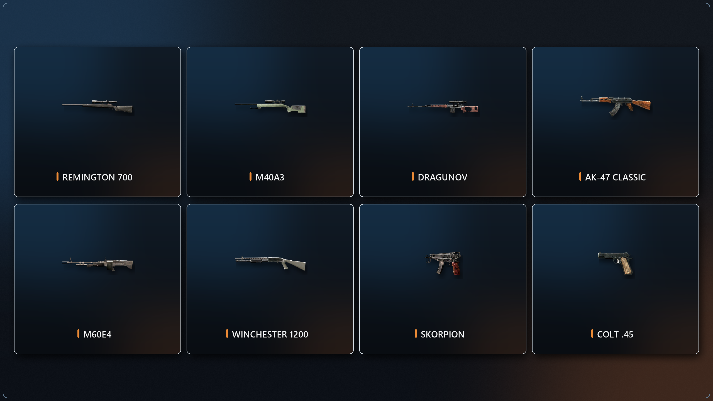

import { Aside, FileTree, LinkButton } from "@astrojs/starlight/components";

The CoD Xe IW4 Fastfiles pack expands Call of Duty: Modern Warfare 2
multiplayer with additional maps, weapons, and game modes.

<Aside type="caution" title="Public prerelease">
  Version **0.1.0** is an early public release. You may encounter visual issues,
  gameplay issues, or crashes. Not every map supports every game mode.
</Aside>

## Included Content

### Maps

- Contingency
- Cliffhanger
- Airport
- Endgame
- Shipment
- Oilrig
- D.C. Burning
- D.C. EMP
- Safe House
- Museum
- Village
- Pripyat
- The Pit
- Caves
- Credits

### Weapons

- Remington 700
- M40A3
- Dragunov
- AK-47 Classic
- M60E4
- Winchester 1200
- Skorpion
- Colt .45

### Game Modes

- Global Thermonuclear War
- One Flag
- Arena
- VIP

## What You Need

- A **genuine USA / Europe copy** of Call of Duty: Modern Warfare 2
- The game extracted to a normal folder
- Modern Warfare 2 **TU6**
- The latest **CoD Xe** plugin
- One of these setups:
  - An Xbox 360 that can run unsigned code: **XDK**, **RGH**, **JTAG**, or **BadUpdate**
  - **Xenia Canary Netplay** on Windows

<Aside type="danger" title="CoD Xe is required">
  This download contains game fastfiles only. It does **not** include the CoD Xe
  plugin and will not work without it.
</Aside>

Install CoD Xe before continuing:

<LinkButton href="/guides/codxe/" icon="right-arrow">
  Install **CoD Xe**
</LinkButton>

## Install TU6

This prerelease requires Modern Warfare 2 **TU6**.

<Aside type="caution" title="Remove TU9 first">
  If the **TU9** file is installed, Xbox 360 or Xenia will prefer it over TU6.
  Delete TU9 before installing TU6.

On Xbox 360, the TU9 file is stored at
`Hdd1/Cache/TU_10LC20N_0000018000000.000000000028A`.

</Aside>

<LinkButton
  href="https://github.com/codxenon/xbox360-title-updates/raw/refs/heads/main/games/Call%20of%20Duty%20-%20Modern%20Warfare%202%20%28USA%2C%20Europe%29/TU6/TU_10LC20N_0000018000000.00000000001GA"
  download
  icon="download"
>
  Download **Modern Warfare 2 TU6**
</LinkButton>

On Xbox 360, copy the TU6 file to `Hdd1/Cache/`. On Xenia, select `File` >
`Install Content...` and choose the downloaded TU6 file.

## Install The Fastfiles

Download the archive:

<LinkButton
  href="https://downloads.codxenon.dev/codxe-iw4-fastfiles-v0.1.0.zip"
  download
  icon="download"
>
  Download **CoD Xe IW4 Fastfiles v0.1.0**
</LinkButton>

Extract the contents of the `.zip` directly into your Call of Duty: Modern
Warfare 2 game folder. Allow the included `_codxe` folder to merge with your
existing `_codxe` folder.

Do **not** delete or replace your existing `_codxe` folder.

When installed correctly, the relevant files should look like this:

<FileTree>

- `Call of Duty - Modern Warfare 2`
  - \_codxe
    - zone
      - codxe_patch_mp.ff
      - codxe_ui_mp.ff
      - imagefile5.pak
      - mp_shipment.ff
      - mp_sp_airport.ff
      - ...
  - default_mp.xex
  - ...

</FileTree>

## Using The Fastfiles

Start Modern Warfare 2 multiplayer through your normal CoD Xe setup, then open
a private match or System Link lobby.

<Aside type="note" title="Play with friends on Xbox Live">
  The fastfiles work in Xbox Live private matches, so you can play the added
  content online with friends. Everyone joining should install CoD Xe and the
  same version of the IW4 Fastfiles pack first.
</Aside>

- Additional maps appear in the map selection menus.
- Additional weapons appear in Create-a-Class.
- Additional game modes appear in the game mode selection menu.

The ported maps are compatible with
[IW4 Bot Warfare](/guides/iw4/bot-warfare/), so you can play them with bots in
private matches. Bot Warfare is optional and is not included in this download.

## Credits

- [Laupetin](https://github.com/Laupetin) —
  [OpenAssetTools](https://github.com/Laupetin/OpenAssetTools) was the basis of
  the custom tooling created to author these fastfiles. Without it, this would not exist.
- The [IW4x team](https://iw4x.io/) — all map entity data used by the ported
  maps was taken directly from the IW4x project.
