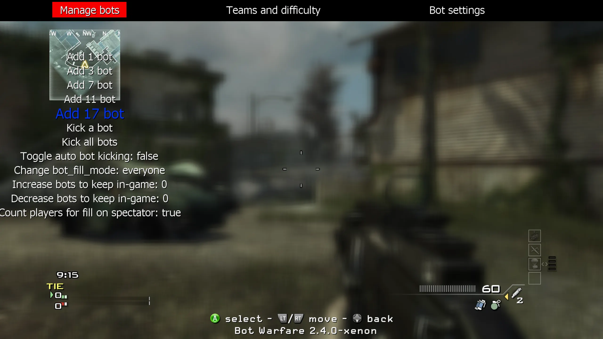

import {
  Aside,
  Badge,
  CardGrid,
  FileTree,
  LinkButton,
  LinkCard,
} from "@astrojs/starlight/components";

Bot Warfare adds playable AI bots to Call of Duty: Modern Warfare 3 multiplayer.

It works in offline System Link matches and online Xbox Live private matches.
Modern Warfare 3 saves multiplayer progression in offline System Link, so you
can level up and build custom classes in a fully offline setup.

The original mod was created by [INeedGames](https://ineedbots.github.io). This
port runs through the CoD Xe plugin.

## What You Need

- A **genuine** copy of Call of Duty: Modern Warfare 3
- The Call of Duty: Modern Warfare 3 title update used by this guide: **TU24**

## Before You Begin

Prepare a clean game folder and install CoD Xe before continuing with the title
update and Bot Warfare installation.

<CardGrid>
  <LinkCard
    title="Prepare game files"
    href="/guides/prepare-game-files/"
    description="Use clean, unmodified game files."
  />
  <LinkCard
    title="Install Modern Warfare 3 TU24"
    href="/reference/supported-games/"
    description="Download TU24 and install it for your platform."
  />
  <LinkCard
    title="Xbox 360"
    href="/guides/codxe/xbox-360/"
    description="Install CoD Xe on an Xbox 360."
  />
  <LinkCard
    title="Xenia"
    href="/guides/codxe/xenia/"
    description="Install CoD Xe on Xenia Canary."
  />
</CardGrid>

## Install Bot Warfare

Download the latest IW5 Bot Warfare release:

<LinkButton
  href="https://github.com/codxenon/iw5-bot-warfare-xenon/releases/download/v2.4.0-xenon/iw5bw-2.4.0-xenon.zip"
  download
  icon="download"
>
  Download **IW5 Bot Warfare**
</LinkButton>

Extract the contents of the `.zip` into your Call of Duty: Modern Warfare 3
game folder.

When installed correctly, your folder should look like this:

<FileTree>

- `Call of Duty - Modern Warfare 3`
  - \_codxe
    - codxe.json
    - mods
      - bot_warfare
        - maps/
        - scriptdata/
        - scripts/
  - default_mp.xex
  - ...

</FileTree>

## Using Bot Warfare

Start Call of Duty: Modern Warfare 3 multiplayer.

If the mod loaded, you will see the `Mod: bot_warfare` text in the top left.

{/* TODO: Add a screenshot showing the active `bot_warfare` mod indicator. */}

### Bot Limits and Performance

Use the **Bot awareness quality** setting in the Bot Warfare menu to balance
performance and responsiveness. Lower settings use less performance, but bots
take longer to notice enemies. **Medium** is the default starting point.

<Aside type="caution" title="Xbox 360 performance">
  There is no fixed bot limit. Start with a small number of bots and add more
  gradually. If the match slows down, lower Bot awareness quality or reduce the
  bot count.
</Aside>

Xenia can handle more bots than Xbox 360, depending on the map and your PC.
Start lower and increase the count if performance stays stable.

### In-Game Menu

In a System Link or private match, press <Badge text="D-Pad Down" /> to open the
Bot Warfare menu. Use it to add bots, change bot difficulty, and adjust
settings.

### Rename Bots

Bot names are stored in `botnames.txt`.

Open the file and add one bot name per line:

<FileTree>

- `Call of Duty - Modern Warfare 3`
  - \_codxe
    - mods
      - bot_warfare
        - scriptdata
          - **botnames.txt**
  - ...

</FileTree>

## Source Code

<LinkCard
  title="IW5 Bot Warfare Xenon port"
  href="https://github.com/codxenon/iw5-bot-warfare-xenon"
  description="View the Xenon port source code on GitHub."
/>
