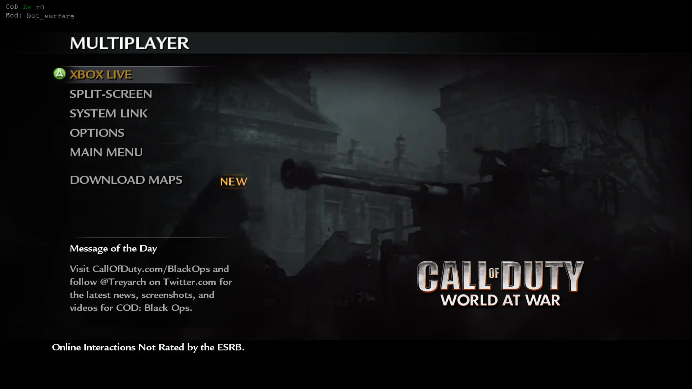
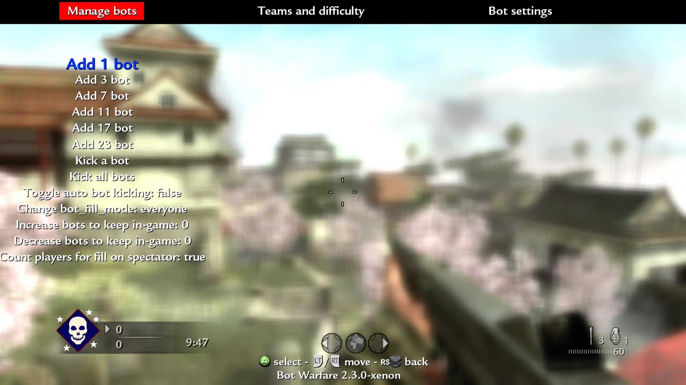

import {
  Aside,
  CardGrid,
  FileTree,
  LinkButton,
  LinkCard,
} from "@astrojs/starlight/components";

Bot Warfare adds playable AI bots to Call of Duty: World at War multiplayer.

The original mod was created by [INeedGames](https://ineedbots.github.io). This port runs through the CoD Xe plugin.

<LinkButton
  href="https://github.com/codxenon/t4-bot-warfare-xenon"
  icon="github"
>
  View **T4 Bot Warfare Xenon port** on GitHub
</LinkButton>

## What You Need

- A **genuine** copy of Call of Duty: World at War
- The game extracted to a normal folder
- The latest Call of Duty: World at War title update: **TU7**
- One of these setups:
  - An Xbox 360 that can run unsigned code: **XDK**, **RGH**, **JTAG**, or **BadUpdate**
  - **Xenia Canary Netplay** on Windows

<Aside type="caution" title="Supported region">
  Use the **USA / Europe** region of Call of Duty: World at War. Other regions
  are not supported.
</Aside>

<Aside type="danger" title="Xenia stability">
  Call of Duty: World at War is very unstable in Xenia. Crashes are expected and
  effectively guaranteed; it is only a matter of when they happen.
</Aside>

## Prepare The Game

Extract Call of Duty: World at War to a normal folder.

Do not use:

- GOD / Games on Demand format
- ISO format

Your game folder should contain the normal game files, such as `default_mp.xex`.

## Install CoD Xe

CoD Xe is required. Bot Warfare will not load without it.

Install CoD Xe first, then return to this guide:

<CardGrid>
  <LinkCard
    title="Xbox 360"
    href="/guides/codxe/xbox-360/"
    description="Install CoD Xe on an Xbox 360."
  />
  <LinkCard
    title="Xenia"
    href="/guides/codxe/xenia/"
    description="Install CoD Xe on Xenia Canary."
  />
</CardGrid>

## Install Title Update

World at War must be running **TU7**. Install the compatible title update, then
return to this guide:

<LinkCard
  title="Install World at War TU7"
  href="/reference/supported-games/"
  description="Download TU7 and follow the installation guide for your platform."
/>

## Install Bot Warfare

Download the latest T4 Bot Warfare release:

<LinkButton
  href="https://github.com/codxenon/t4-bot-warfare-xenon/releases/download/v2.4.0-xenon/t4bw-2.4.0-xenon.zip"
  download
  icon="download"
>
  Download **T4 Bot Warfare**
</LinkButton>

Extract the contents of the `.zip` into your Call of Duty: World at War game
folder.

When installed correctly, your folder should look like this:

<FileTree>

- `Call of Duty - World at War`
  - \_codxe
    - codxe.json
    - mods
      - bot_warfare
        - maps/
        - scriptdata/
        - scripts/
  - default_mp.xex
  - ...

</FileTree>

## Using Bot Warfare

Start Call of Duty: World at War multiplayer.

If the mod loaded, you will see the `Mod: bot_warfare` text in the top left:

Load a System Link or private match game, then open the Bot Warfare menu by
pressing the primary grenade and secondary grenade buttons together.

### Bot Limits

<Aside type="caution" title="Xbox 360 bot limit">
  Use **7 or 8 bots** for the best results. Higher bot counts can cause lag on
  Xbox 360.
</Aside>

<Aside type="note" title="Xenia bot limit">
  Xenia can handle higher bot counts than Xbox 360, depending on the map and
  your PC. Start lower and increase the count if performance stays stable.
</Aside>

### In-Game Menu

Use the in-game menu to add bots, change bot difficulty, and adjust bot
settings.

### Rename Bots

Bot names are stored in `botnames.txt`.

Open the file and add one bot name per line:

<FileTree>

- `Call of Duty - World at War`
  - \_codxe
    - mods
      - bot_warfare
        - scriptdata
          - **botnames.txt**
  - ...

</FileTree>
