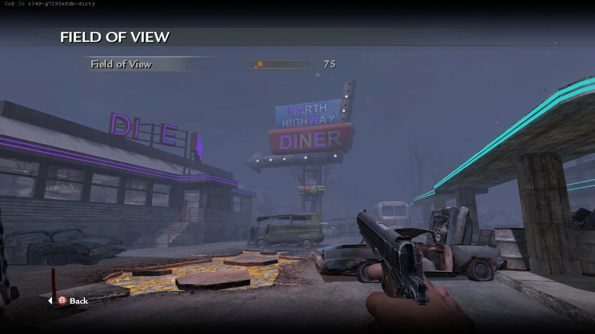

import {
  Aside,
  CardGrid,
  FileTree,
  LinkButton,
  LinkCard,
} from "@astrojs/starlight/components";

import CodXeUpdateNotice from "../../../../components/CodXeUpdateNotice.astro";

This package contains the CoD Xe fastfiles needed to play custom zombie maps in
Call of Duty: World at War.

<CodXeUpdateNotice />

<Aside type="caution" title="Public prerelease">
  Version **0.3.0** is an early public release. You may encounter visual issues,
  gameplay issues, performance drops, or crashes.
</Aside>

## What's New in v0.3.0

- More maps
- Dynamically populated menu list
- `cg_fovscale` slider in **Start** > **Options**.

## What's New in v0.2.0

- More maps
- Loading screens
- A Field of View slider in **Start** > **Options**.

## Known Issues

- Missing sounds
- Low quality textures
- Pack-a-Punch on certain weapons on certain maps can crash the game

:::note[Map credits]
All credit and respect goes to the original creators of the included custom
zombie maps.
:::

## Included Custom Zombie Maps

All listed maps have been tested in local Split Screen and on Xbox 360 hardware.

- **Cargoship Zombies** (`cargoship`)
- **Kino Der Toten** (`kinodertoten`)
- **Super Mario 64** (`mario`)
- **Aztec** (`nazi_zombie_aztec`)
- **Cheese Cube Unlimited** (`nazi_zombie_ccube_u`)
- **DerBerg** (`nazi_zombie_derberg`)
- **Five Nights at Freddy's** (`nazi_zombie_fivenights`)
- **Halloween Town** (`nazi_zombie_halloween`)
- **Hijacked** (`nazi_zombie_hijacked`)
- **Leviathan** (`nazi_zombie_leviathan`)
- **Lorkeep Station** (`nazi_zombie_lorkeep`)
- **McDonald's** (`nazi_zombie_mcdonalds`)
- **Beverstedt Zombies v1.3** (`nazi_zombie_nabo`)
- **Quizz V2** (`nazi_zombie_quizz_v2`)
- **Doll House 2** (`nazi_zombie_sc_dh2`)
- **Clinic Of Evil** (`sanatorium`)
- **Spongebob** (`spongebob`)
- **Standoff Winter** (`zm_standoff_winter`)
- **Terminus** (`zm_terminus`)
- **BO2 Town Expanded** (`zm_tranzit`)
- **Empty Walls** (`zm_wall`)

## What You Need

- A **genuine USA / Europe copy** of Call of Duty: World at War
- Call of Duty: World at War **TU7**
- The latest **CoD Xe** plugin

Prepare a clean game folder and install CoD Xe before continuing:

<CardGrid>
  <LinkCard
    title="Prepare game files"
    href="/guides/prepare-game-files/"
    description="Use clean, unmodified game files."
  />
  <LinkCard
    title="Install World at War TU7"
    href="/reference/supported-games/"
    description="Download TU7 and install it for your platform."
  />
  <LinkCard
    title="Xbox 360"
    href="/guides/codxe/xbox-360/"
    description="Install CoD Xe on an Xbox 360."
  />
  <LinkCard
    title="Xenia"
    href="/guides/codxe/xenia/"
    description="Install CoD Xe on Xenia Canary."
  />
</CardGrid>

## Download and Install

<LinkButton
  href="https://downloads.codxenon.dev/codxe-t4-fastfiles-v0.3.0.zip"
  download
  icon="download"
>
  Download **CoD Xe T4 Fastfiles v0.3.0**
</LinkButton>

0. Update to the latest CoD Xe plugin.
1. Extract the `.zip`.
2. Open the extracted `codxe-t4-fastfiles-v0.3.0` folder.
3. Copy its `_codxe` folder into your World at War game folder and allow it to
   merge with your existing `_codxe` folder.

:::note[New layout with legacy support]
This release uses the new `_codxe/t4` layout. The previous `_codxe/zone` and
`_codxe/usermaps` layout is still accepted for compatibility with existing
installs.
:::

This release is self-contained. You can delete your existing `_codxe` folder
before copying the one from the archive.

When installed correctly, the relevant files should look like this:

<FileTree>

- `Call of Duty - World at War`
  - \_codxe
    - t4
      - zone/
      - usermaps
        - mario/
        - nazi_zombie_aztec/
        - nazi_zombie_ccube_u/
        - ...
  - default.xex
  - default_mp.xex

</FileTree>

## Field of View

Open **Start** > **Options**, then select **Field of View** to adjust the
slider.

## Split Screen

All listed maps support local Split Screen.

