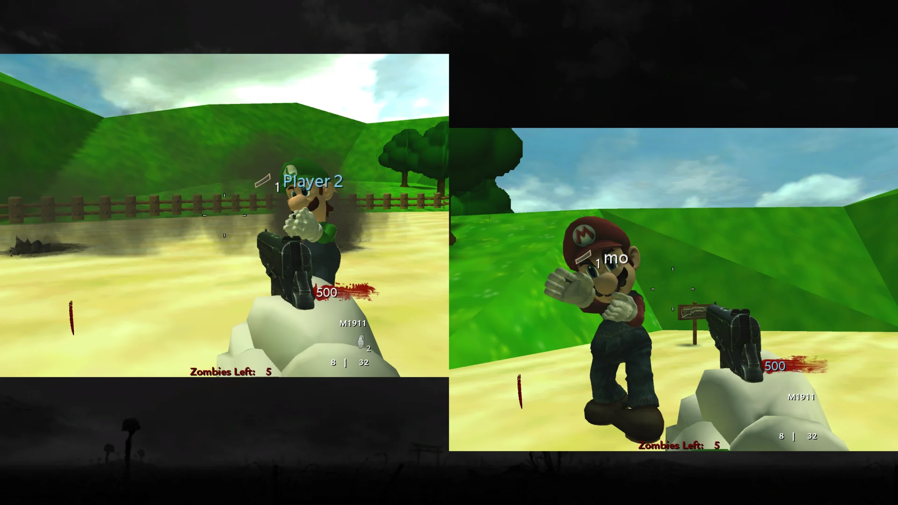

import {
  Aside,
  CardGrid,
  FileTree,
  LinkButton,
  LinkCard,
} from "@astrojs/starlight/components";

import CodXeUpdateNotice from "../../../../components/CodXeUpdateNotice.astro";

This package contains the CoD Xe fastfiles needed to play six custom zombie
maps in Call of Duty: World at War.

<CodXeUpdateNotice />

<Aside type="caution" title="Public prerelease">
  Version **0.1.0** is an early public release. You may encounter visual issues,
  gameplay issues, performance drops, or crashes.
</Aside>

## Known Issues

- Some map sounds are currently missing.
- The custom maps do not currently have loading screens.

:::note[Map credits]
All credit and respect goes to the original creators of the included custom
zombie maps.
:::

## Included Custom Zombie Maps

- **Mario** (`mario`)
- **Aztec** (`nazi_zombie_aztec`)
- **Cheese Cube** (`nazi_zombie_ccube_u`)
- **Halloween** (`nazi_zombie_halloween`)
- **Hijacked** (`nazi_zombie_hijacked`)
- **SpongeBob** (`spongebob`)

## What You Need

- A **genuine USA / Europe copy** of Call of Duty: World at War
- Call of Duty: World at War **TU7**
- The latest **CoD Xe** plugin

Prepare a clean game folder and install CoD Xe before continuing:

<CardGrid>
  <LinkCard
    title="Prepare game files"
    href="/guides/prepare-game-files/"
    description="Use clean, unmodified game files."
  />
  <LinkCard
    title="Install World at War TU7"
    href="/reference/supported-games/"
    description="Download TU7 and install it for your platform."
  />
  <LinkCard
    title="Xbox 360"
    href="/guides/codxe/xbox-360/"
    description="Install CoD Xe on an Xbox 360."
  />
  <LinkCard
    title="Xenia"
    href="/guides/codxe/xenia/"
    description="Install CoD Xe on Xenia Canary."
  />
</CardGrid>

## Download and Install

<LinkButton
  href="https://downloads.codxenon.dev/codxe-t4-fastfiles-v0.1.0.zip"
  download
  icon="download"
>
  Download **CoD Xe T4 Fastfiles v0.1.0**
</LinkButton>

0. Update to the latest CoD Xe plugin.
1. Extract the `.zip`.
2. Open the extracted `codxe-t4-fastfiles-v0.1.0` folder.
3. Copy its `_codxe` folder into your World at War game folder and allow it to
   merge with your existing `_codxe` folder.

Do **not** delete or replace your existing `_codxe` folder.

When installed correctly, the relevant files should look like this:

<FileTree>

- `Call of Duty - World at War`
  - \_codxe
    - zone
      - **patch.ff**
      - **patch_ui.ff**
    - usermaps
      - mario
        - mario.ff
      - nazi_zombie_aztec
        - nazi_zombie_aztec.ff
      - nazi_zombie_ccube_u
        - nazi_zombie_ccube_u.ff
      - ...
  - default_mp.xex
  - ...

</FileTree>

## Split Screen

All six included maps support local Split Screen.

